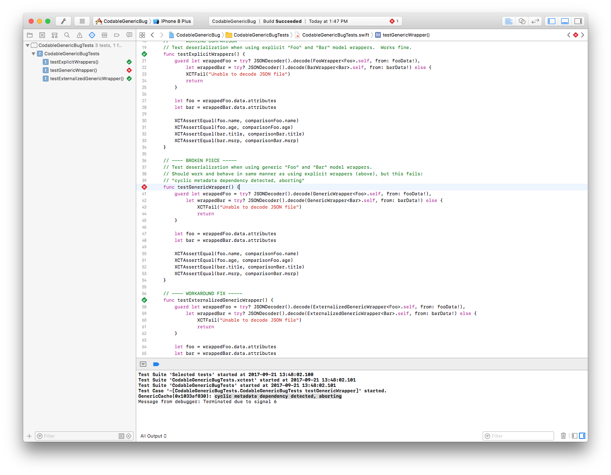
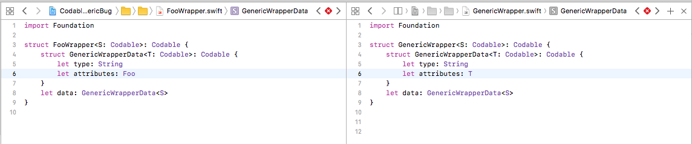
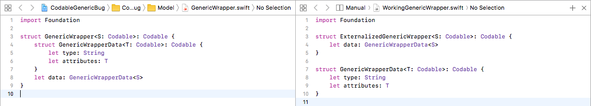

# CodeableGenericBug

This project illustrates a compiler or framework issue with Swift 4 and iOS 10.  It occurs when deserializing generics in nested structs using the Codable interface.

## Context

The use-case that uncovered this bug is as follows:

1. I have a client application that consumes data from a web service
2. Data is encapsulated as models (e.g. `Foo` and `Bar`) and marshalled via JSON
3. The JSON representation of these objects is wrapped in a common structure (that can include metadata or other info)
4. Swift objects can mirror both the original models (i.e. `Foo` and `Bar`) as well as the wrappers returned by the service (i.e. `FooWrapper` and `BarWrapper`)
5. Implementing the Codable interface and leveraging Swift 4's `JSONDecoder` works fine when using explicitly-typed wrapper structs
6. Using a generic or common wrapper triggers an unexpected runtime error within `JSONDecoder.decode`

## How to use this project

Three scenarios are isolated as unit tests.  All logic is encapulated in the unit test file.  Open and run that file.

1. Open `CodableGenericBugTests.swift` in XCode
2. Click the topmost diamond to compile the project and run all the unit tests
3. Hit the debugger's "resume"button when second test triggers a runtime error and halts test execution

## Expected vs Actual Behavior

#### Expected Behavior
* All 3 unit tests pass.
* The structs `FooWrapper`, `GenericWrapper`, and `WorkingGenericWrapper` all behave in functionally-equivalent ways with regards to encoding and decoding

#### Actual Behavior
` One unit test fails
* The struct `GenericWrapper` triggers a runtime error when using it in `JSONDecoder.decode()`

## Scenarios in scope

Three scenarios are tested in the following order:

1. A reference scenario of using a Codable wrapper object.
2. A broken scenario that re-uses the Codable wrapper object, but with a generically-typed object in the inner struct
3. A workaround scenario that successfully uses generic wrappers, but does so by not using an inline struct definition

## Comparisons

* `FooWrapper` (working) vs `GenericWrapper` (broken)
* The only difference between the two is that "attributes" is typed as `Foo` on the left and as `T` (generic) on the right
* The left struct works fine for our use case.  The right struct causes a runtime error when decoding.

* `GenericWrapper` (broken) vs `WorkingGenericWrapper` (working)
* The only difference between the two is that one has nested structs defined inline, while the other defines a second struct externally
* The right side can be considered a work-around for the bug triggered by the left side

